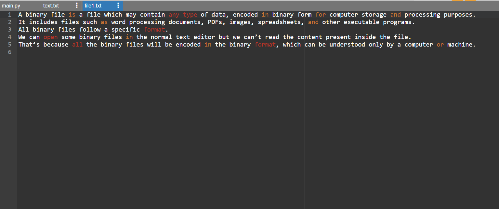

# copy-file
## AIM:
To write a python program for copying the contents from one file to another file.
## EQUIPEMENT'S REQUIRED: 
PC
Anaconda - Python 3.7
## ALGORITHM: 
### Step 1:
Open the file1 in default acces mode.(Read mode)
### Step 2: 
Read the contents of the file1 using .read() function and store the contents in a variable called "content"
### Step 3: 
Now open a new file in write access mode.
### Step 4:  
If there isn't one the compiler itself creates one.
### Step 5: 
Use .write() function with argument of content(variable with contents of file1). 
### Step 6: 
End of the Program.

## PROGRAM:
```
#Program to copy a content form one file to another 
#Developed By:S.S.Sanjay Kumar
#Register Number:21005845

with open('text.txt') as fp:
    data=fp.read()
with open('file1.txt','w') as fp1:
    fp1.write(data)
```

### OUTPUT:



## RESULT:
Thus the program is written to copy the contents from one file to another file.